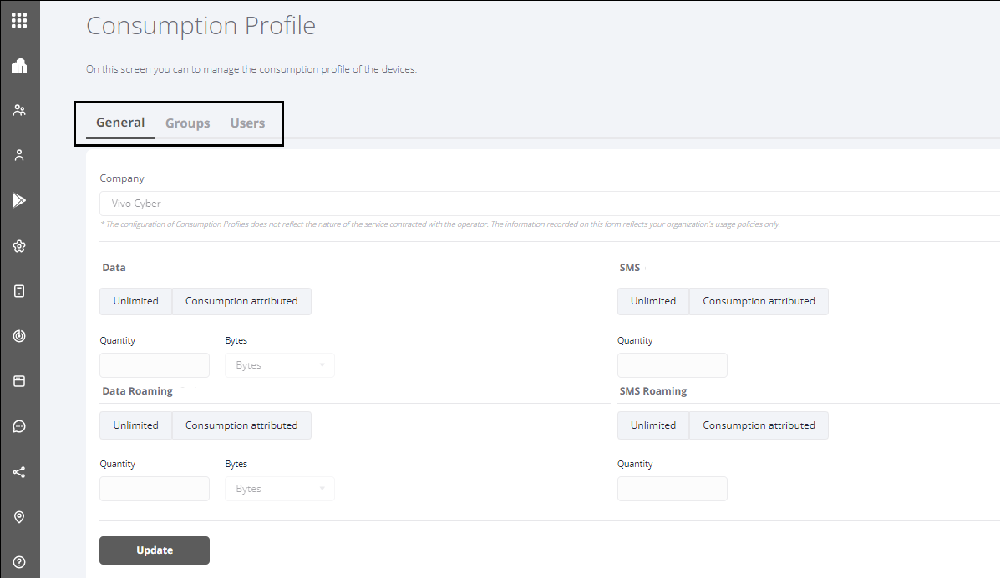

---
layout:
  title:
    visible: true
  description:
    visible: false
  tableOfContents:
    visible: true
  outline:
    visible: true
  pagination:
    visible: true
---

# Initial Settings and Levels

Ao acessar o Portal **\<NomeProduto>**, o usuário terá acesso às configurações e funcionalidades.

### Initial Settings 

When accessing the **\<NomeProduto>** Portal, the user will have access to the settings and functionalities.

* **Consumption Profile** - so that all captured data can be analyzed correctly (detailed in the "[Consumption Profile](configuracoes/perfil-de-consumo.md)" section of this manual).
* **Cycle start day** - to set the start date for accounting the data that will be analyzed (detailed in the "[General Settings](empresas/configuracoes-gerais.md)" section of this manual).

### Setting Levels 

Settings can be made at three levels (Company/Group/User) and these settings are applied to the devices as follows:

* **Company (General)** - When creating a configuration at this level, the system will check whether there is a rule configured at user level. If it doesn't, it checks to see if there is a rule configured at Group level and, if there isn't either, the system will apply the rule configured at Company level to the Company devices;
* **Group** - When creating a configuration at this level, the system will check whether a configuration exists at the User level; if not, the system will apply the rule configured at the Group level to the devices in the group;
* **User** - When you create a configuration at this level, the system will apply the configured rule to the user's device.

The following image shows the consumption profile configuration screen which is accessed from the "**Settings**" menu. A rectangle highlights access to the "General", "Groups" and "Users" tabs.

<figure><figcaption></figcaption></figure>
