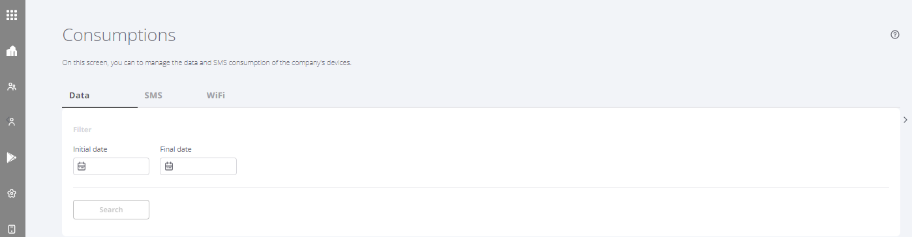
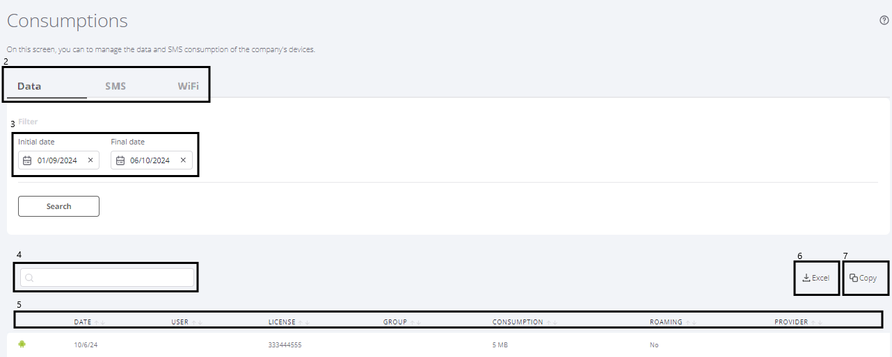

---
layout:
  title:
    visible: true
  description:
    visible: false
  tableOfContents:
    visible: true
  outline:
    visible: true
  pagination:
    visible: true
---

# Company Consumption

The purpose of this system screen is to allow the user to view the mobile data and SMS consumption of all the company's devices over a range of dates. To access this screen, the user must be a Portal Administrator.

To view your consumption, follow the steps below.

1. Click on the "**Company**" menu and select the "**Consumptions**" submenu.

<figure><figcaption></figcaption></figure>

<figure><figcaption></figcaption></figure>

2. Click on the "**Data**", "**SMS**" or Wi-Fi tab to choose the type of consumption you want to see.
3. Fill in the dates of the interval in which the Data or SMS you wish to view were consumed. Clicking on "Search" will display the consumption history, by user, for the period specified.
4. If you want to view the consumption of a specific device, enter the device number in the "Search" field.
5. To sort the information displayed, click on the title of the information you want (Date, User, Telephone, Company...)
6. To export the consumption information, click on the "Excel" button.
7. To copy the consumption information, click on the "Copy" button.

<figure><figcaption></figcaption></figure>


**NOTE**

SMS information is only available for Android.

